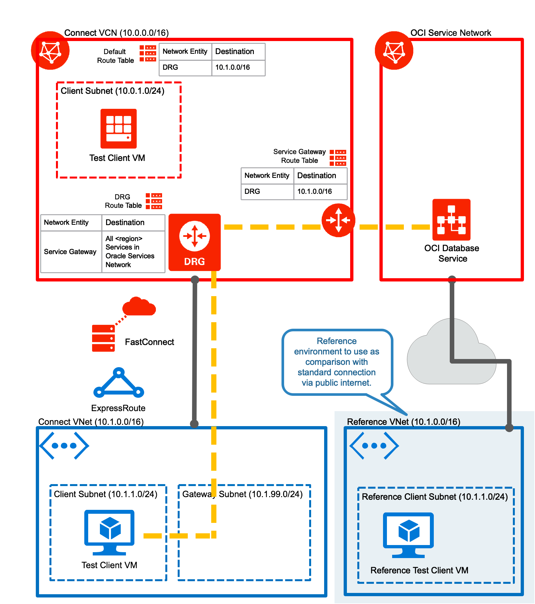

# Environment for connecting to an Autonmous Database via Microsoft Azure - Oracle Cloud (OCI) interconnect using Transit Routing

Here you can find terraform scripts for setting up an environment for testing an Autonomous Database connection from Azure using interconnect and transit routing. 

You can find a more detailed discussion of this code in [my blog post covering this topic.](https://blog.maxjahn.at/2020/03/accessing-oracle-autonomous-database-on-oci-from-microsoft-azure-using-transit-routing/)

For testing there are 2 Azure VNets set up:
- VNet connect_vnet connected to OCI via interconnect (FastConnect & ExpressConnect) 
- VNet ref_vnet whithout interconnect as a reference.

There are 2 VMs set up with Oracle instant client (basic, tools, sqlplus, jdbc). As well swingbench is downloaded to /tmp/oci for doing some performance testing.
- client_instance connected via interconnect
- ref_instance connected via publuc internet

